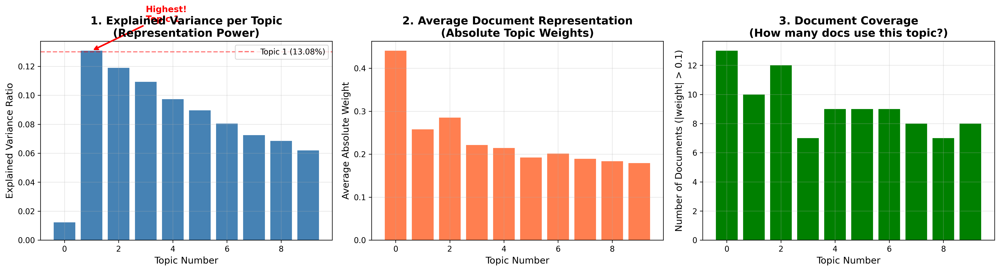

# Use explained vairanace to choice topics



Topic 1 (highest explained variance) has the leading representation power!
What This Means:
Explained Variance = Representation Power
In LSA (and all PCA-based methods):
Higher explained variance = Stronger representation power
Topic 1 (13.08% variance) is the most important pattern in your corpus
It's the primary dimension along which documents differ
Your Specific Data:
```
From the bar chart in cell 18:
Topic 0:  1.22% ██                    ← Least important pattern
Topic 1: 13.08% ██████████████████    ← MOST important pattern ✅
Topic 2: 11.89% ████████████████      
Topic 3: 10.93% ██████████████
...
```
## What Topic 1 Represents:
Content: Police incidents, hunting accidents, investigations (警方, 現場, 樹林, 打獵) Why it has highest variance:
Some documents are strongly about this (high positive weights)
Other documents are not about this at all (low/negative weights)
This creates maximum variation across the corpus
Therefore: most discriminative feature
## Important Distinction:
Metric	Topic 0	Topic 1
Explained Variance	1.22% (lowest)	13.08% (highest) ✅
Avg Prevalence	0.44 (highest)	0.26
Interpretation	Common background theme	Most distinctive pattern
Topic 0: High prevalence but LOW variance → appears everywhere but doesn't distinguish documents
Topic 1: Lower prevalence but HIGH variance → strongly present in some docs, absent in others → powerful discriminator
## Visualization Created:
a comprehensive comparison chart:
data/08_reporting/explained_variance_vs_representation.png
This shows the relationship between variance and representation across all topics.
Bottom Line: Topic 1's highest explained variance (13.08%) means it has the strongest representation power - it's the most important "lens" through which to understand how your documents differ from each other!

## Understanding Prevalence
Prevalence refers to the frequency or commonness of something within a particular context or population. In general usage, it describes how widespread or often-occurring a phenomenon, condition, or characteristic is.

### In Data Science and Statistics
In statistical analysis and data science, prevalence typically measures the proportion of a population that exhibits a particular characteristic at a given time. For example, if you're analyzing a dataset of 1,000 patients and 200 have a specific condition, the prevalence would be 20%.

### In Topic Modeling Context
Given your file name mentions "explained variance to choice topics," prevalence in this context likely refers to how dominant or common a particular topic is across your document corpus. When performing topic modeling (using techniques like Latent Dirichlet Allocation or Non-negative Matrix Factorization), some topics may appear frequently across many documents (high prevalence), while others might be rare or niche (low prevalence).

### Understanding topic prevalence helps you:

Identify `major themes` in your dataset
Filter out overly common or rare topics
Make informed decisions about the optimal number of topics to retain
Balance your analysis between dominant and specialized subjects
Practical Consideration
When evaluating topics based on explained variance, you might want to consider both the variance explained by a topic AND its prevalence to ensure you're not selecting topics that are either too ubiquitous (appearing everywhere but not meaningful) or too rare (high variance but limited applicability).